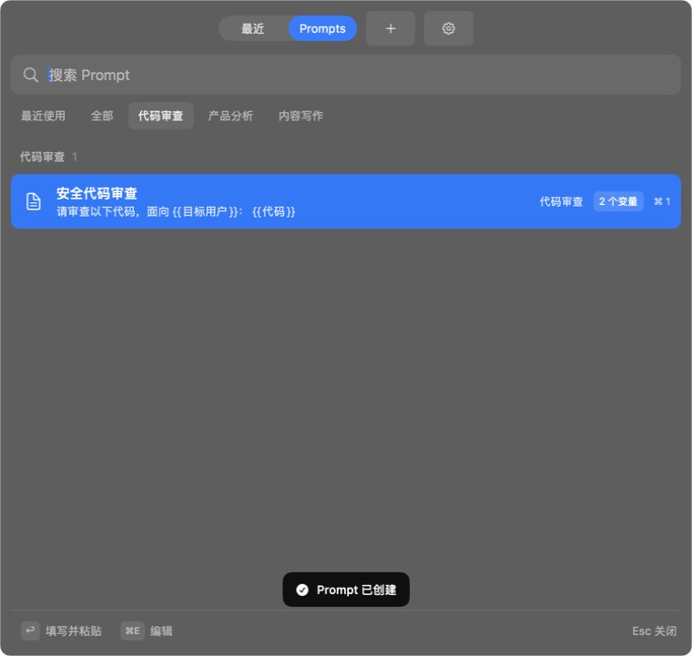
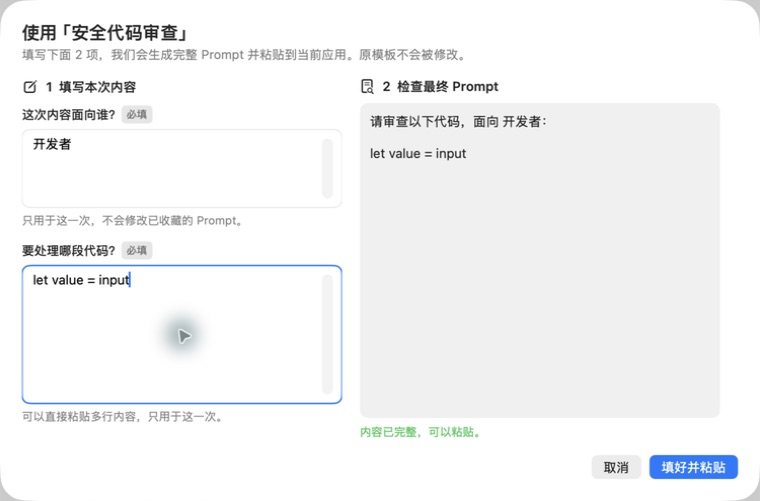

# PromptPick

<p align="center">
  <strong>为 AI 重度用户设计的 Mac 剪贴板：把复制过的好 Prompt 收藏起来，并随时调用。</strong>
</p>

<p align="center">
  <a href="https://github.com/zairuilab/PromptPick/releases"><strong>下载试用版</strong></a> ·
  <a href="https://github.com/zairuilab/PromptPick/issues">反馈问题</a> ·
  <a href="https://github.com/zairuilab/PromptPick/blob/main/LICENSE">MIT License</a>
</p>

<p align="center">
  
</p>

普通剪贴板只记得“你刚刚复制了什么”。PromptPick 进一步帮你记住“哪些 Prompt 值得反复使用”。

它把两条路径放进同一个快捷面板：

- 临时内容留在剪贴板历史里，支持搜索和来源应用识别；
- 好 Prompt 可以直接从历史收藏，命名后放进代码审查、产品分析、内容写作等场景；
- 固定模板一键粘贴；
- 带变量的模板用清晰的自然语言表单填写，再生成最终 Prompt。

## 为什么不是再做一个剪贴板

你的 Prompt 通常不是一次性文本，而是会不断复用的工作资产。PromptPick 让它们从“按时间堆在一起的历史记录”变成“按场景找得到、按关键词搜得到、最近用过排在前面”的个人 Prompt 库。

## 从复制到调用，只有三步

1. **复制**：像平常一样复制 Prompt 或其他内容。
2. **收藏**：在剪贴板历史选中一条内容，保存为 Prompt，补全名称和场景。
3. **调用**：全局快捷呼出，按场景、关键词或最近使用找到它；需要填变量时，填写后直接粘贴到当前 AI 对话。

<p align="center">
  
</p>

变量不是让你学习一套新语法。你看到的是“这次要填什么”，右侧会实时展示“最终会粘贴什么”。原模板不会被修改。

## 当前版本能做什么

- 剪贴板历史、搜索与来源应用展示
- 从剪贴板历史收藏为 Prompt，并补全名称与场景
- Prompt 场景分类、关键词搜索、最近使用排序
- 固定 Prompt 一键粘贴
- 变量 Prompt 引导填写、实时预览与粘贴
- Prompt JSON 导入与导出
- 数据默认保存在本机
- 菜单栏常驻、全局快捷呼出、明确的关闭与退出路径

## 下载试用

前往 [GitHub Releases](https://github.com/zairuilab/PromptPick/releases) 下载最新 Dogfood 版本。

当前安装包使用临时签名，尚未经过 Apple 公证。首次运行时，在 Finder 中右键 App 选择“打开”；受公司 MDM 管理的 Mac 可能禁止运行。

## 隐私边界

剪贴板历史和 Prompt 数据默认只保存在本机，不上传云端。提交 Issue 或截图前，请确认没有包含密码、Token、公司机密或其他敏感内容。安全问题请按 [SECURITY.md](SECURITY.md) 私下报告。

<details>
<summary>开发、测试与贡献</summary>

### 开发环境

- macOS 14+
- Xcode 16+
- Swift / SwiftUI / AppKit

克隆仓库后，用 Xcode 打开 `Maccy.xcodeproj`，选择 `Maccy` Scheme 构建运行。Swift Package 版本锁定在 `Package.resolved`。

```bash
xcodebuild \
  -project Maccy.xcodeproj \
  -scheme Maccy \
  -destination 'platform=macOS' \
  build
```

### 测试

项目包含单元测试和 macOS UI 测试。UI Runner 建议使用系统标准 DerivedData 目录；运行测试前请退出其他同 Bundle ID 的 PromptPick 实例。

```bash
xcodebuild build-for-testing \
  -project Maccy.xcodeproj \
  -scheme Maccy \
  -testPlan Maccy \
  -destination 'platform=macOS' \
  -derivedDataPath "$HOME/Library/Developer/Xcode/DerivedData/PromptPick-UIRunner"

xcodebuild test-without-building \
  -project Maccy.xcodeproj \
  -scheme Maccy \
  -testPlan Maccy \
  -destination 'platform=macOS' \
  -derivedDataPath "$HOME/Library/Developer/Xcode/DerivedData/PromptPick-UIRunner"
```

UI 自动化需要在“系统设置 → 隐私与安全性 → 辅助功能”中允许 Xcode 及测试 Runner。

Bug、体验问题和功能建议可以通过 [Issues](https://github.com/zairuilab/PromptPick/issues) 提交。贡献代码前请阅读 [CONTRIBUTING.md](CONTRIBUTING.md)。

</details>

## 来源与许可证

PromptPick 基于 [Maccy](https://github.com/p0deje/Maccy) 衍生开发：

- Maccy 原始代码保留其 MIT License，见 [LICENSE](LICENSE)；
- PromptPick 新增与修改代码采用 MIT License，见 [LICENSE-PROMPTPICK](LICENSE-PROMPTPICK)；
- 派生版本和隔离边界见 [DERIVATION_NOTICE.md](DERIVATION_NOTICE.md)；
- 第三方依赖和许可证正文见 [THIRD_PARTY_NOTICES.md](THIRD_PARTY_NOTICES.md) 与 `THIRD_PARTY_LICENSES/`；
- MIT License 不授予 PromptPick 名称与标识的商标使用权，见 [TRADEMARKS.md](TRADEMARKS.md)。

## 项目状态

PromptPick 仍处于 Dogfooding / Pre-release 阶段。当前重点是验证 AI 重度用户能否持续复用“剪贴板历史 → Prompt 资产 → 快速调用”的工作流。
